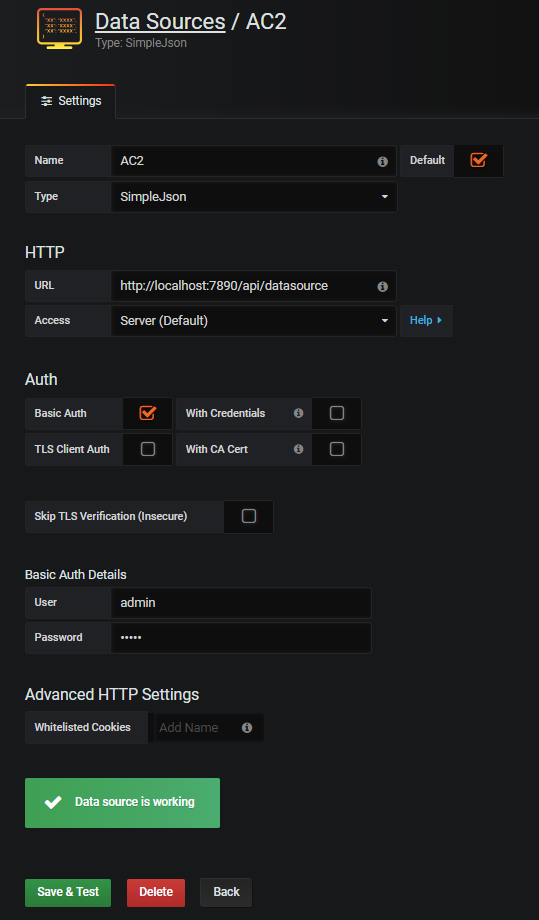
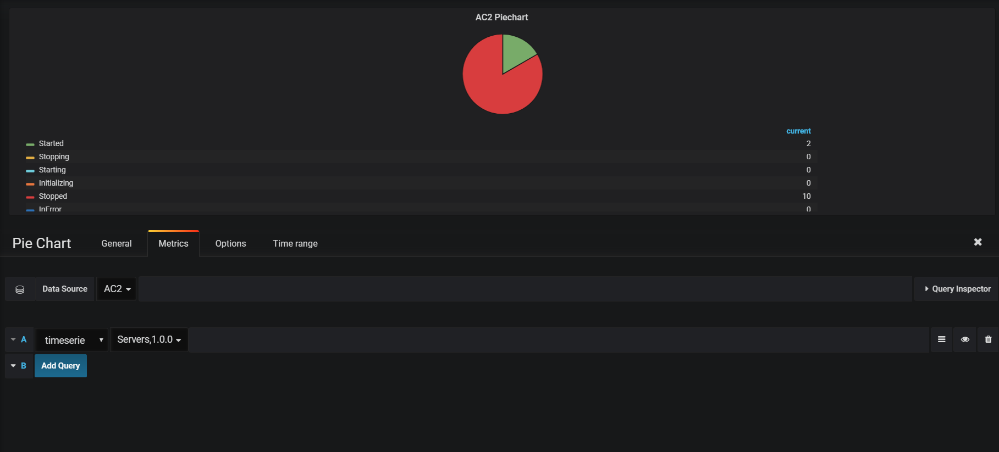
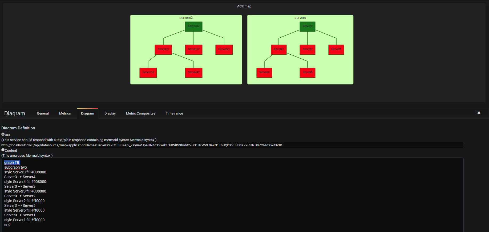

# DashboardAC2
DashboardAC2 is package that allows you to monitor AC2 applications via a web interface

# Build
* Download the git repository<br>
* Launch the command line: ``` ./build.ps1 ```


# Start
* Launch the command line: ``` .\grafana-5.2.2\bin\grafana-server.exe -homepath .\grafana-5.2.2\ ```<br>
* Open browser on http://localhost:3000

# Data Sources
Before getting the dashboard to be displayed correctly, data sources configuration is required. Configure the datasource as following:
* Name: The name of the datasource<br>
* Type: SimpleJson, install the plugin "grafana-simple-json-datasource" is required to view it on the list<br>
* URL: "The URL of AC2 web application" concatenate with "/api/datasource"<br>
* Auth: Check "Basic Auth" and login with AC2 credentials in "Basic Auth Details"<br>
* Finally, click "Save & Test" button to check out that everything is working fine<br><br>


# Dashboard
* To create a dashboard click on "Create your first dashboard"
* Click on "Add panel" to view the available panels for the dashboard
* Then AC2 can be monitored using Pie Chart or Diagram panels 

# PieChart
* Select the appropriate data source
* Select the AC2 application <br>


# Diagram
In Diagram section, create the URL to target as following:<br>
* "address of the data source"  + "/map/" + "?applicationName=xxx" + "&api_key=xxx"
where applicationName is application to display and api_key is a token generated with swagger using the AC2 credentials. 
For example, URL could be like: http://localhost:7890/api/datasource/map?applicationName=Server&api_key=xxx

